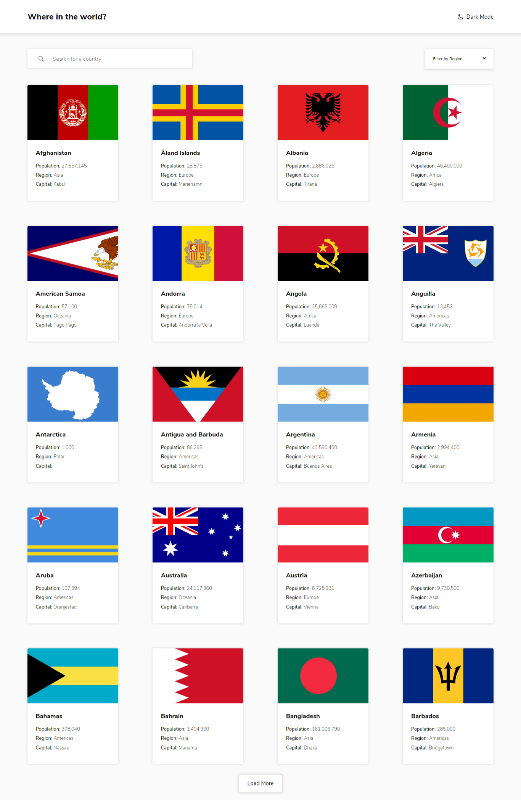

# Frontend Mentor - Todo app solution

This is a solution to the [Rest Countries Api challenge on Frontend Mentor](https://www.frontendmentor.io/challenges/rest-countries-api-with-color-theme-switcher-5cacc469fec04111f7b848ca). Frontend Mentor challenges help you improve your coding skills by building realistic projects. 

## Table of contents

- [Overview](#overview)
  - [The challenge](#the-challenge)
  - [Screenshot](#screenshot)
  - [Links](#links)
- [My process](#my-process)
  - [Built with](#built-with)
  - [What I learned](#what-i-learned)
  - [Continued development](#continued-development)
  - [Useful resources](#useful-resources)
- [Author](#author)
- [Acknowledgments](#acknowledgments)

### The challenge

Users should be able to:

- View the optimal layout for the site depending on their device's screen size
- See hover states for all interactive elements on the page

### Screenshot

### Links

Live Site URL: [Live site of the challenge](https://cocky-booth-9d499e.netlify.app/)

## My process

Hello, this is my 22nd challenge in Frontend Mentor. This challenge was really fun to do and this challenge can really boost up your framework skill since there are lots of repetitions that are fundametally needed in learning a framework. 

I used react on this one because it is the framework that I am learning. But still, I don't know if what I did is technically correct via "react" way but in the end, managed to still pull it off.

I focused on accessibility more and I hope I made it accessible, the way I wanted it to be.

### Built with

- Semantic HTML5 markup
- CSS custom properties
- FlexBox
- Grid
- Sass preprocessor
- React
- Gulp for SCSS pre-processing

### What I learned

I learned in this challenge to use properly different hooks, well I think I used properly or not :>. 
There are still things that I have doubts but I will try to be better in using React for future challenges and I hope I will implement things that are correct in "React's" eye.

### Continued development

I want to practice more about React!!

## Author

- Website - Well I haven't made my profile portfolio, gonna make it sooon when I know a lot of stuffs
- Frontend Mentor - [@pikamart](https://www.frontendmentor.io/profile/pikamart)
- Twitter - [@RaymartPamplona](https://twitter.com/RaymartPamplona)
